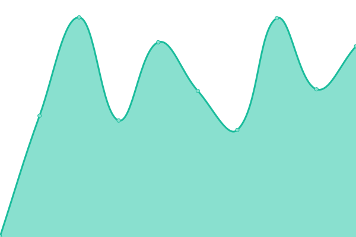
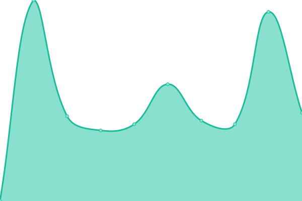
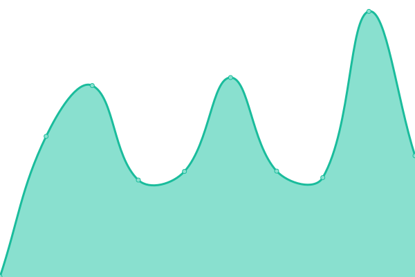

# [📈 Live Status](https://status.herzog.tech): <!--live status--> **🟧 Partial outage**

This repository contains the open-source uptime monitor and status page for [Leo](https://herzog.tech/), powered by [Upptime](https://github.com/upptime/upptime).

With [Upptime](https://upptime.js.org), you can get your own unlimited and free uptime monitor and status page, powered entirely by a GitHub repository. We use [Issues](https://github.com/leoherzog/HopeStatus/issues) as incident reports, [Actions](https://github.com/leoherzog/HopeStatus/actions) as uptime monitors, and [Pages](https://status.herzog.tech) for the status page.

<!--start: status pages-->
<!-- This summary is generated by Upptime (https://github.com/upptime/upptime) -->
<!-- Do not edit this manually, your changes will be overwritten -->
<!-- prettier-ignore -->
| URL | Status | History | Response Time | Uptime |
| --- | ------ | ------- | ------------- | ------ |
|  [hope.edu](https://hope.edu/) | 🟨 Degraded | [hope-edu.yml](https://github.com/Hope-College-CIT/status/commits/HEAD/history/hope-edu.yml) | 

 2103ms
     
 | 

<a href="https://status.herzog.tech/history/hope-edu">98.38%</a>
    

|  [Spring 2024 Moodle](https://courses202401.hope.edu/) | 🟩 Up | [spring-2024-moodle.yml](https://github.com/Hope-College-CIT/status/commits/HEAD/history/spring-2024-moodle.yml) | 

 283ms
     
 | 

<a href="https://status.herzog.tech/history/spring-2024-moodle">100.00%</a>
    

|  [Summer 2024 Moodle](https://courses202405.hope.edu/) | 🟩 Up | [summer-2024-moodle.yml](https://github.com/Hope-College-CIT/status/commits/HEAD/history/summer-2024-moodle.yml) | 

 228ms
     
 | 

<a href="https://status.herzog.tech/history/summer-2024-moodle">100.00%</a>
    

|  [Moodle Groups](https://groups.hope.edu/) | 🟩 Up | [moodle-groups.yml](https://github.com/Hope-College-CIT/status/commits/HEAD/history/moodle-groups.yml) | 

 262ms
     
 | 

<a href="https://status.herzog.tech/history/moodle-groups">100.00%</a>
    

|  [PLUS Homepage](https://plus.hope.edu/) | 🟩 Up | [plus-homepage.yml](https://github.com/Hope-College-CIT/status/commits/HEAD/history/plus-homepage.yml) | 

 139ms
     
 | 

<a href="https://status.herzog.tech/history/plus-homepage">100.00%</a>
    

|  [PLUS Login](https://prodbannersso.hope.edu/ssomanager/c/SSB) | 🟥 Down | [plus-login.yml](https://github.com/Hope-College-CIT/status/commits/HEAD/history/plus-login.yml) | 

 556ms
     
 | 

<a href="https://status.herzog.tech/history/plus-login">60.94%</a>
    

|  [blogs.hope.edu](https://blogs.hope.edu/) | 🟩 Up | [blogs-hope-edu.yml](https://github.com/Hope-College-CIT/status/commits/HEAD/history/blogs-hope-edu.yml) | 

 780ms
     
 | 

<a href="https://status.herzog.tech/history/blogs-hope-edu">100.00%</a>
    

|  [forms.hope.edu](https://forms.hope.edu/) | 🟩 Up | [forms-hope-edu.yml](https://github.com/Hope-College-CIT/status/commits/HEAD/history/forms-hope-edu.yml) | 

 332ms
     
 | 

<a href="https://status.herzog.tech/history/forms-hope-edu">100.00%</a>
    

|  [magazine.hope.edu](https://blogs.hope.edu/) | 🟩 Up | [magazine-hope-edu.yml](https://github.com/Hope-College-CIT/status/commits/HEAD/history/magazine-hope-edu.yml) | 

 307ms
     
 | 

<a href="https://status.herzog.tech/history/magazine-hope-edu">100.00%</a>
    

|  [wths.hope.edu](https://wths.hope.edu/) | 🟩 Up | [wths-hope-edu.yml](https://github.com/Hope-College-CIT/status/commits/HEAD/history/wths-hope-edu.yml) | 

 906ms
     
 | 

<a href="https://status.herzog.tech/history/wths-hope-edu">100.00%</a>
    

|  [anchor.hope.edu](https://anchor.hope.edu/) | 🟩 Up | [anchor-hope-edu.yml](https://github.com/Hope-College-CIT/status/commits/HEAD/history/anchor-hope-edu.yml) | 

 702ms
     
 | 

<a href="https://status.herzog.tech/history/anchor-hope-edu">100.00%</a>
    

|  [opus.hope.edu](https://opus.hope.edu/) | 🟩 Up | [opus-hope-edu.yml](https://github.com/Hope-College-CIT/status/commits/HEAD/history/opus-hope-edu.yml) | 

 6315ms
     
 | 

<a href="https://status.herzog.tech/history/opus-hope-edu">100.00%</a>
    

|  [B-lite](https://blite.hope.edu/) | 🟩 Up | [b-lite.yml](https://github.com/Hope-College-CIT/status/commits/HEAD/history/b-lite.yml) | 

 371ms
     
 | 

<a href="https://status.herzog.tech/history/b-lite">100.00%</a>
    

|  [Course Schedule](https://schedule.hope.edu/) | 🟩 Up | [course-schedule.yml](https://github.com/Hope-College-CIT/status/commits/HEAD/history/course-schedule.yml) | 

 961ms
     
 | 

<a href="https://status.herzog.tech/history/course-schedule">100.00%</a>
    

|  [Schedule Planner](https://hope.collegescheduler.com/entry) | 🟩 Up | [schedule-planner.yml](https://github.com/Hope-College-CIT/status/commits/HEAD/history/schedule-planner.yml) | 

 1020ms
     
 | 

<a href="https://status.herzog.tech/history/schedule-planner">100.00%</a>
    

|  [EMS Web App](https://events.hope.edu/) | 🟩 Up | [ems-web-app.yml](https://github.com/Hope-College-CIT/status/commits/HEAD/history/ems-web-app.yml) | 

 442ms
     
 | 

<a href="https://status.herzog.tech/history/ems-web-app">100.00%</a>
    

|  [Ebon DNS Server](209.140.194.2) | 🟩 Up | [ebon-dns-server.yml](https://github.com/Hope-College-CIT/status/commits/HEAD/history/ebon-dns-server.yml) | 

 22ms
     
 | 

<a href="https://status.herzog.tech/history/ebon-dns-server">100.00%</a>
    

|  [Amber DNS Server](209.140.194.50) | 🟩 Up | [amber-dns-server.yml](https://github.com/Hope-College-CIT/status/commits/HEAD/history/amber-dns-server.yml) | 

 21ms
     
 | 

<a href="https://status.herzog.tech/history/amber-dns-server">100.00%</a>
    

<!--end: status pages-->

[**Visit our status website →**](https://status.herzog.tech)

## 📄 License

- Powered by: [Upptime](https://github.com/upptime/upptime)
- Code: [MIT](./LICENSE) © [Leo](https://herzog.tech/)
- Data in the `./history` directory: [Open Database License](https://opendatacommons.org/licenses/odbl/1-0/)
