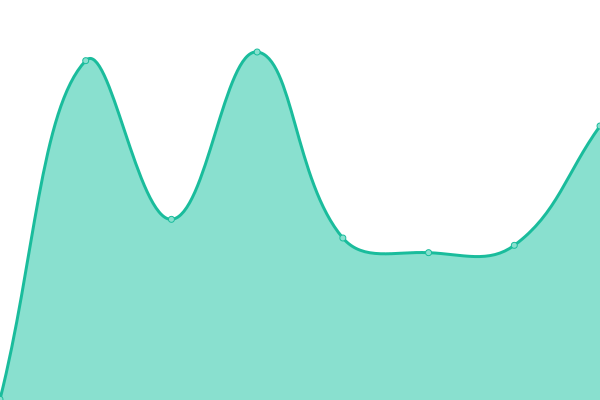

# [📈 Live Status](https://status.herzog.tech): <!--live status--> **🟥 Complete outage**

This repository contains the open-source uptime monitor and status page for [Leo](https://herzog.tech/), powered by [Upptime](https://github.com/upptime/upptime).

With [Upptime](https://upptime.js.org), you can get your own unlimited and free uptime monitor and status page, powered entirely by a GitHub repository. We use [Issues](https://github.com/leoherzog/HopeStatus/issues) as incident reports, [Actions](https://github.com/leoherzog/HopeStatus/actions) as uptime monitors, and [Pages](https://status.herzog.tech) for the status page.

<!--start: status pages-->
<!-- This summary is generated by Upptime (https://github.com/upptime/upptime) -->
<!-- Do not edit this manually, your changes will be overwritten -->
<!-- prettier-ignore -->
| URL | Status | History | Response Time | Uptime |
| --- | ------ | ------- | ------------- | ------ |
|  [hope.edu](https://hope.edu/) | 🟥 Down | [hope-edu.yml](https://github.com/leoherzog/HopeStatus/commits/HEAD/history/hope-edu.yml) | 

 1543ms
     
 | 

<a href="https://status.herzog.tech/history/hope-edu">99.82%</a>
    

|  [Fall 2023 Moodle](https://courses202308.hope.edu/) | 🟥 Down | [fall-2023-moodle.yml](https://github.com/leoherzog/HopeStatus/commits/HEAD/history/fall-2023-moodle.yml) | 

 349ms
     
 | 

<a href="https://status.herzog.tech/history/fall-2023-moodle">99.94%</a>
    

|  [Summer 2023 Moodle](https://courses202305.hope.edu/) | 🟥 Down | [summer-2023-moodle.yml](https://github.com/leoherzog/HopeStatus/commits/HEAD/history/summer-2023-moodle.yml) | 

 0ms
     
 | 

<a href="https://status.herzog.tech/history/summer-2023-moodle">0.00%</a>
    

|  [Moodle Groups](https://groups.hope.edu/) | 🟥 Down | [moodle-groups.yml](https://github.com/leoherzog/HopeStatus/commits/HEAD/history/moodle-groups.yml) | 

 455ms
     
 | 

<a href="https://status.herzog.tech/history/moodle-groups">99.95%</a>
    

|  [PLUS Homepage](https://plus.hope.edu/) | 🟥 Down | [plus-homepage.yml](https://github.com/leoherzog/HopeStatus/commits/HEAD/history/plus-homepage.yml) | 

 439ms
     
 | 

<a href="https://status.herzog.tech/history/plus-homepage">99.96%</a>
    

|  [PLUS Login](https://prodbannersso.hope.edu/ssomanager/c/SSB) | 🟥 Down | [plus-login.yml](https://github.com/leoherzog/HopeStatus/commits/HEAD/history/plus-login.yml) | 

 608ms
     
 | 

<a href="https://status.herzog.tech/history/plus-login">99.96%</a>
    

|  [blogs.hope.edu](https://blogs.hope.edu/) | 🟥 Down | [blogs-hope-edu.yml](https://github.com/leoherzog/HopeStatus/commits/HEAD/history/blogs-hope-edu.yml) | 

 796ms
     
 | 

<a href="https://status.herzog.tech/history/blogs-hope-edu">99.97%</a>
    

|  [forms.hope.edu](https://forms.hope.edu/) | 🟥 Down | [forms-hope-edu.yml](https://github.com/leoherzog/HopeStatus/commits/HEAD/history/forms-hope-edu.yml) | 

 442ms
     
 | 

<a href="https://status.herzog.tech/history/forms-hope-edu">99.97%</a>
    

|  [B-lite](https://blite.hope.edu/) | 🟥 Down | [b-lite.yml](https://github.com/leoherzog/HopeStatus/commits/HEAD/history/b-lite.yml) | 

 419ms
     
 | 

<a href="https://status.herzog.tech/history/b-lite">99.98%</a>
    

|  [Course Schedule](https://schedule.hope.edu/) | 🟥 Down | [course-schedule.yml](https://github.com/leoherzog/HopeStatus/commits/HEAD/history/course-schedule.yml) | 

 860ms
     
 | 

<a href="https://status.herzog.tech/history/course-schedule">99.99%</a>
    

|  [Schedule Planner](https://hope.collegescheduler.com/entry) | 🟥 Down | [schedule-planner.yml](https://github.com/leoherzog/HopeStatus/commits/HEAD/history/schedule-planner.yml) | 

 1220ms
     
 | 

<a href="https://status.herzog.tech/history/schedule-planner">99.99%</a>
    

|  [EMS Web App](https://events.hope.edu/) | 🟥 Down | [ems-web-app.yml](https://github.com/leoherzog/HopeStatus/commits/HEAD/history/ems-web-app.yml) | 

 1442ms
     
 | 

<a href="https://status.herzog.tech/history/ems-web-app">100.00%</a>
    

<!--end: status pages-->

[**Visit our status website →**](https://status.herzog.tech)

## 📄 License

- Powered by: [Upptime](https://github.com/upptime/upptime)
- Code: [MIT](./LICENSE) © [Leo](https://herzog.tech/)
- Data in the `./history` directory: [Open Database License](https://opendatacommons.org/licenses/odbl/1-0/)
